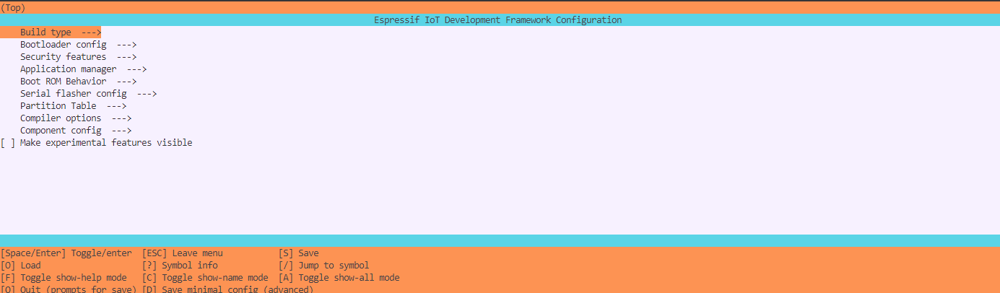
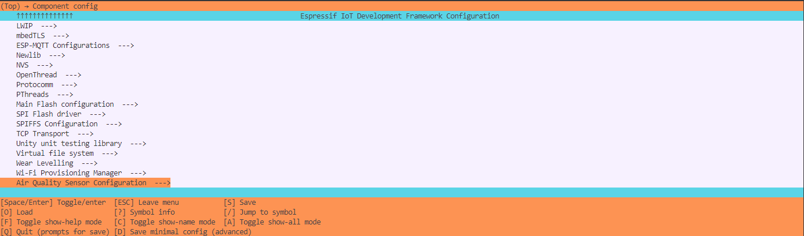
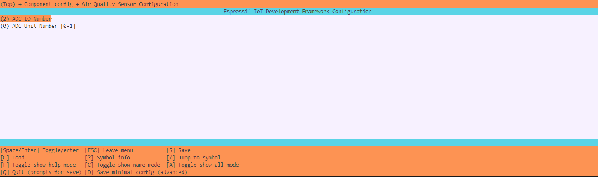

# Sensor Development Using ESP-IDF

This wiki covers how to build you own sensor libraries in ESP-IDF as components so as it can be used in multiple projects.

# What is a Component in ESP-IDF?

In **ESP-IDF**, a **component** is a modular unit of code that serves as a building block for an application. Components encapsulate specific functionality, such as hardware drivers, libraries, or application logic, making them reusable across different projects.

## Key Characteristics of a Component
1. **Independent and Reusable**: Components are self-contained and can be reused in multiple projects.
2. **Directory Structure**: Each component has its own directory, typically including:
   - A `CMakeLists.txt` file for build configuration.
   - Source files (`.c`, `.cpp`) and headers (`.h`).
   - Optionally, a `Kconfig` file for configuration.
3. **Dependencies**: Components can declare dependencies on other components, and the build system resolves these automatically.
4. **Modularity**: Components help divide applications into smaller, manageable parts.
5. **Integration**: Components in the `components` directory or linked via paths are automatically included in the build process.

---

## Types of Components
1. **Built-in Components**: Provided by ESP-IDF, including:
   - Peripheral drivers (GPIO, UART, I2C, etc.).
   - Networking libraries (Wi-Fi, Bluetooth, TCP/IP stack).
   - Protocol libraries (MQTT, HTTP, etc.).
   - OS-related modules (FreeRTOS, task management).

2. **Custom Components**: Created by developers for specific application logic.

3. **Third-Party Components**: External libraries integrated into the project.

---

## Creating a Custom Component
To create a custom component, follow these steps:

1. Create a directory for your component (e.g., `my_component`) in the `components/` directory.
2. Add source files (`.c` or `.cpp`) and header files.
3. Write a `CMakeLists.txt` file for the build system.
4. Optionally, add a `Kconfig` file for configuration options.

:::tip
Quick way to create your own component 
- In the ESP-IDF project folder, Go for View->Command Palette
- Search for ESP-IDF: Create New ESP-IDF Component
:::

### Example Directory Structure

```shell
project/ 
├── components/ 
│ ├── my_component/ 
│ │ ├── CMakeLists.txt 
│ │ ├── my_component.c 
│ │ └── include/ 
│ │ └── my_component.h
```

## How to follow along ?

Pick-up one of the following XIAO Boards.

<div class="table-center">
  <table align="center">
    <tr>
        <th>Seeed Studio XIAO ESP32C3</th>
        <th>Seeed Studio XIAO ESP32S3(Sense)</th>
			  <th>Seeed Studio XIAO ESP32C6</th>
    </tr>
    <tr>
        <td><div style={{textAlign:'center'}}></div></td>
        <td><div style={{textAlign:'center'}}></div></td>
        <td><div style={{textAlign:'center'}}></div></td>
		</tr>
    <tr>
      <td><div class="get_one_now_container" style={{textAlign: 'center'}}>
          <a class="get_one_now_item" href="https://www.seeedstudio.com/seeed-xiao-esp32c3-p-5431.html">
              <strong><span><font color={'FFFFFF'} size={"4"}> Get One Now 🖱️</font></span></strong>
          </a>
      </div></td>
      <td><div class="get_one_now_container" style={{textAlign: 'center'}}>
            <a class="get_one_now_item" href="https://www.seeedstudio.com/seeed-xiao-esp32c3-p-5431.html">
                <strong><span><font color={'FFFFFF'} size={"4"}> Get One Now 🖱️</font></span></strong>
            </a>
        </div></td>
      <td><div class="get_one_now_container" style={{textAlign: 'center'}}>
          <a class="get_one_now_item" href="https://www.seeedstudio.com/XIAO-ESP32S3-Sense-p-5639.html">
              <strong><span><font color={'FFFFFF'} size={"4"}> Get One Now 🖱️</font></span></strong>
          </a>
      </div></td>
    </tr>
  </table>
</div>

---

## Making a basic sensor library

For this I am using an analog sensor [Air Quality Sensor v1.3](https://www.seeedstudio.com/Grove-Air-Quality-Sensor-v1-3-Arduino-Compatible.html).

<div class="github_container" style={{textAlign: 'center'}}>
    <a class="github_item" href="https://github.com/Priyanshu0901/Air_Quality_Sensor_v1_3.git">
    <strong><span><font color={'FFFFFF'} size={"4"}> Download the Code</font></span></strong> <svg aria-hidden="true" focusable="false" role="img" className="mr-2" viewBox="-3 10 9 1" width={16} height={16} fill="currentColor" style={{textAlign: 'center', display: 'inline-block', userSelect: 'none', verticalAlign: 'text-bottom', overflow: 'visible'}}><path d="M8 0c4.42 0 8 3.58 8 8a8.013 8.013 0 0 1-5.45 7.59c-.4.08-.55-.17-.55-.38 0-.27.01-1.13.01-2.2 0-.75-.25-1.23-.54-1.48 1.78-.2 3.65-.88 3.65-3.95 0-.88-.31-1.59-.82-2.15.08-.2.36-1.02-.08-2.12 0 0-.67-.22-2.2.82-.64-.18-1.32-.27-2-.27-.68 0-1.36.09-2 .27-1.53-1.03-2.2-.82-2.2-.82-.44 1.1-.16 1.92-.08 2.12-.51.56-.82 1.28-.82 2.15 0 3.06 1.86 3.75 3.64 3.95-.23.2-.44.55-.51 1.07-.46.21-1.61.55-2.33-.66-.15-.24-.6-.83-1.23-.82-.67.01-.27.38.01.53.34.19.73.9.82 1.13.16.45.68 1.31 2.69.94 0 .67.01 1.3.01 1.49 0 .21-.15.45-.55.38A7.995 7.995 0 0 1 0 8c0-4.42 3.58-8 8-8Z" /></svg>
    </a>
</div>

### Hardware Setup

Attach the ESP based Xiao (XIAO-ESP32C3,XIAO-ESP32C6,XIAO-ESP32S3,XIAO-ESP32S3(Sense)) to the [Grove - Expansion Board](https://www.seeedstudio.com/Seeeduino-XIAO-Expansion-board-p-4746.html) and connect the [Air Quality Sensor v1.3](https://www.seeedstudio.com/Grove-Air-Quality-Sensor-v1-3-Arduino-Compatible.html) to the analog connector.

<p style={{textAlign: 'center'}}></p>

### Software Setup

After pulling the git repository, open the folder in VSCode. Go to View->Command Palette->ESP-IDF: Add vscode Configuration Folder.

From the bottom panel select the correct COM port, chip (ESP32C3/S3/C6) and build,flash and monitor.

### Component Library Usage

This component is designed in a way to easily integrate with [Air Quality Sensor v1.3](https://www.seeedstudio.com/Grove-Air-Quality-Sensor-v1-3-Arduino-Compatible.html).

#### Changing the ADC Unit and Channel

Depending on the chip-set used (XIAO-ESP32C3,XIAO-ESP32C6,XIAO-ESP32S3), the exact ADC Unit and Channel will vary.

:::info
ADC Unit and ADC Channel can be found by cross-referencing the schematic of the XIAO board with the technical document of the chip-set.
:::

1. In the vscode extension click on this icon to open an esp-idf terminal   


2. In the ESP-IDF Shell type in :   
```shell
idf.py menuconfig
```
   
     
   
   

#### Example Usage

This code demonstrates how to interface with an air quality sensor in an ESP32 environment using **FreeRTOS tasks**. It includes initializing the sensor, polling data from it, and printing the results. The implementation creates two tasks: one for reading the sensor and another for displaying its data.

---

## Code Breakdown

### Constants and Global Variables
```c
#define WAIT_TIMEOUT 25000
air_quality_sensor_t air_quality_sensor;
```
- `WAIT_TIMEOUT` : Defines a timeout of 25 seconds (in milliseconds) to wait for the sensor to be ready after initialization.
- `air_quality_sensor` : A global variable representing the sensor. It stores the sensor's state and data.

---

### `poll_read_air_quality_sensor` Task

Purpose:

To initialize the air quality sensor and periodically read its data.

```c
void poll_read_air_quality_sensor(void *pvParameters)
{
  printf("Starting Air Quality Sensor...\n");
  if (initialize_air_quality_sensor(&air_quality_sensor))
  {
    printf("Sensor ready.\n");
  }
  else
  {
    printf("Sensor ERROR!\n");
  }
  while (air_quality_sensor._is_initialized == 1)
  {
    air_quality_sensor_slope(&air_quality_sensor);
    vTaskDelay(500 / portTICK_PERIOD_MS);
  }
  vTaskDelete(NULL);
}
```

Explanation:

1. Initialization:
    - Attempts to initialize the sensor using initialize_air_quality_sensor().
    - If successful, it prints "Sensor ready."; otherwise, it prints "Sensor ERROR!".

2. Polling:
    - Continuously reads sensor data using air_quality_sensor_slope() if the sensor is initialized (_is_initialized == 1).
    - Waits 500 ms between reads using vTaskDelay() to avoid unnecessary frequent polling.

3. Termination:
    - When the sensor is no longer initialized, the task deletes itself using vTaskDelete(NULL).

---

### `print_read_air_quality_sensor` Task

Purpose:

To wait for the sensor to be ready and print its data at regular intervals.

```c
void print_read_air_quality_sensor(void *pvParameters)
{
  uint32_t current_time = (uint32_t)esp_timer_get_time() / 1000;
  uint32_t timeout_time = current_time + WAIT_TIMEOUT;

  while ((!air_quality_sensor._sensor_ready) && current_time < timeout_time)
  {
    current_time = (uint32_t)esp_timer_get_time() / 1000;
  }

  while (air_quality_sensor._sensor_ready)
  {
    char buf[40];
    air_quality_error_to_message(air_quality_sensor._air_quality, buf, 40);
    printf("Time : %lu\tSlope : %d\tRaw Value : %d\n%s\n", 
           (uint32_t)esp_timer_get_time() / 1000, 
           air_quality_sensor._air_quality, 
           air_quality_sensor._sensor_raw_value, buf);
    vTaskDelay(1000 / portTICK_PERIOD_MS);
  }
  vTaskDelete(NULL);
}
```
Explanation:

1. Waiting for Sensor Readiness:
    - The function waits for the sensor to indicate readiness (_sensor_ready == true).
    - If the sensor does not become ready within the timeout (WAIT_TIMEOUT), it stops waiting.

2. Printing Sensor Data:
    - While the sensor is ready (_sensor_ready), it retrieves and prints:
      - Current time (in milliseconds).
      - Air quality slope (_air_quality).
      - Raw sensor value (_sensor_raw_value).
      - A descriptive error message using air_quality_error_to_message().

3. Interval:
    - Prints data every 1 second using vTaskDelay(1000 / portTICK_PERIOD_MS).

4. Termination:
    - If the sensor stops being ready, the task deletes itself using vTaskDelete(NULL).

---

### `app_main`
Purpose:

To initialize the application and create two FreeRTOS tasks for polling and printing sensor data.

```c
void app_main(void)
{
  xTaskCreatePinnedToCore(
      poll_read_air_quality_sensor,   /* Function that implements the task. */
      "poll_read_air_quality_sensor", /* Text name for the task. */
      configMINIMAL_STACK_SIZE * 2,   /* Stack size in words, not bytes. */
      NULL,                           /* Parameter passed into the task. */
      tskIDLE_PRIORITY + 1,           /* Priority at which the task is created. */
      NULL,                           /* Used to pass out the created task's handle. */
      0);                             /* Core ID */

  xTaskCreatePinnedToCore(
      print_read_air_quality_sensor,   /* Function that implements the task. */
      "print_read_air_quality_sensor", /* Text name for the task. */
      configMINIMAL_STACK_SIZE * 2,    /* Stack size in words, not bytes. */
      NULL,                            /* Parameter passed into the task. */
      tskIDLE_PRIORITY,                /* Priority at which the task is created. */
      NULL,                            /* Used to pass out the created task's handle. */
      0);                              /* Core ID */
}
```

Explanation:

1. Creating poll_read_air_quality_sensor Task:
    - This task runs with a slightly higher priority (tskIDLE_PRIORITY + 1) and uses twice the minimal stack size.

2.  Creating print_read_air_quality_sensor Task:
    - This task runs at the idle priority (tskIDLE_PRIORITY) with the same stack size.

3. Pinned to Core:
    - Both tasks are pinned to core 0 for execution on the same processor.

---

### Output

```shell
Time : 37207    Slope : 3       Raw Value : 273
Fresh air.
Time : 38217    Slope : 3       Raw Value : 269
Fresh air.
Time : 39227    Slope : 3       Raw Value : 274
Fresh air.
Time : 40237    Slope : 3       Raw Value : 251
Fresh air.
Time : 41247    Slope : 3       Raw Value : 276
Fresh air.
Time : 42257    Slope : 3       Raw Value : 250
Fresh air.
Time : 43267    Slope : 3       Raw Value : 236
Fresh air.
Time : 44277    Slope : 3       Raw Value : 253
Fresh air.
Time : 45287    Slope : 3       Raw Value : 245
Fresh air.
Time : 46297    Slope : 3       Raw Value : 249
Fresh air.
Time : 47307    Slope : 3       Raw Value : 244
Fresh air.
Time : 48317    Slope : 3       Raw Value : 235
Fresh air.
Time : 49327    Slope : 3       Raw Value : 239
Fresh air.
Time : 50337    Slope : 3       Raw Value : 233
Fresh air.
Time : 51347    Slope : 3       Raw Value : 235
Fresh air.
```

## Trouble Shooting

Some problems might encounter in the process of hardware connection, software debugging or uploading.

## Tech Support & Product Discussion

Thank you for choosing our products! We are here to provide you with different support to ensure that your experience with our products is as smooth as possible. We offer several communication channels to cater to different preferences and needs.

<div class="button_tech_support_container">
<a href="https://forum.seeedstudio.com/" class="button_forum"></a> 
<a href="https://www.seeedstudio.com/contacts" class="button_email"></a>
</div>

<div class="button_tech_support_container">
<a href="https://discord.gg/eWkprNDMU7" class="button_discord"></a> 
<a href="https://github.com/Seeed-Studio/wiki-documents/discussions/69" class="button_discussion"></a>
</div>
